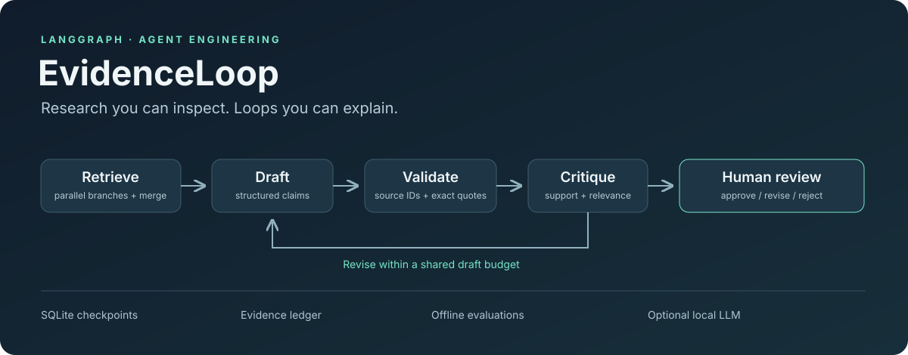
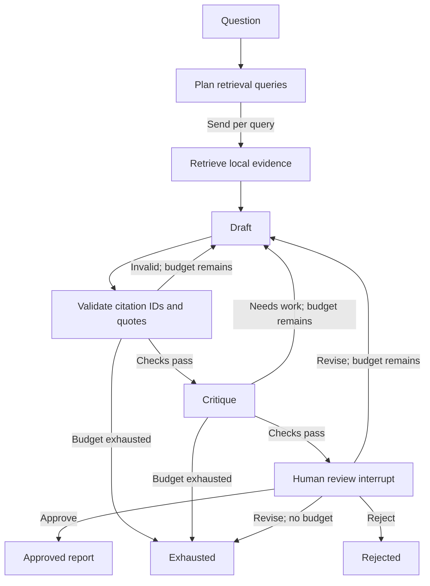

# EvidenceLoop

[](https://github.com/legooz/evidenceloop/actions/workflows/ci.yml)

**A research workflow that has to show its evidence, repair its draft, and ask for review.**



EvidenceLoop turns a question about local documents into a cited report using a LangGraph state machine. It exposes the engineering decisions behind an agent: parallel retrieval, typed outputs, deterministic evidence checks, a bounded revision loop, durable checkpoints, and human approval.

Run the complete workflow with the deterministic demo backend and no API key. Switch to a local Ollama model to experiment with real generation and critique.

> This is an AI-assisted learning project. The demo deliberately injects a citation failure to make the repair path visible. Its evaluation results demonstrate workflow behavior on controlled fixtures, not general research accuracy. The [learning path](docs/learning-path.md) turns this foundation into work you can explain and extend yourself.

## What makes it an engineering project

| Concern | Implementation | What to investigate |
| --- | --- | --- |
| Graph design | `StateGraph`, conditional edges, `Send` retrieval fan-out | Which values can parallel nodes update safely? |
| Loop design | Draft → evidence validation → critique → revise | What stops the loop when quality never improves? |
| Evidence | BM25 retrieval, source locations, exact quote checks | Does a real quote actually support the claim? |
| Reliability | Pydantic contracts and a finite draft budget | What happens when a model returns invalid output? |
| Human control | `interrupt()` and checkpointed approval | Can a different process resume the same run? |
| Observability | Inspectable run state and JSON event traces | Why was this report accepted or blocked? |
| Evaluation | Reproducible scenarios and regression tests | Are you measuring control flow or answer quality? |



This diagram shows the main paths through the reviewed workflow; backend failures and absent evidence also stop execution. `evidenceloop graph` prints the complete graph generated from the implementation. `--no-review` skips the human checkpoint and finishes at `ready`, which cannot be exported as approved.

## Run it

Requires Python 3.11 or later. Run these commands from the repository root.

**Windows PowerShell**

```powershell
py -3 -m venv .venv
.\.venv\Scripts\Activate.ps1
python -m pip install -c constraints.txt -e ".[dev]"
```

**macOS / Linux**

```bash
python3 -m venv .venv
source .venv/bin/activate
python -m pip install -c constraints.txt -e ".[dev]"
```

Start a run against the included example corpus:

```bash
evidenceloop run "How should retries use idempotency and a bounded retry budget?" --backend demo --scenario repair --run-id first-demo
evidenceloop inspect first-demo
evidenceloop inspect first-demo --json
evidenceloop review first-demo --action approve
evidenceloop export first-demo --output report.md
```

The `repair` scenario omits a citation from its first draft on purpose. The validator catches it, the next draft supplies citations, and execution pauses for review. Inspect the claims and quotes before approving. Each new run needs a new run ID; reviewing an existing run resumes its saved state.

Try a human revision using a fresh run:

```bash
evidenceloop run "How do checkpoints help an agent?" --scenario clean --run-id review-demo
evidenceloop review review-demo --action revise --feedback "Make the limitations explicit."
evidenceloop inspect review-demo
evidenceloop review review-demo --action approve
```

The demo backend is scripted, so it exercises revision routing without promising that arbitrary feedback changes its prose. Ollama provides the model-driven version of this experiment. Human revisions share the same `--max-drafts` budget as automatic revisions.

## Run a local model

Install [Ollama](https://ollama.com/), start its local service, and download a model:

```bash
ollama pull llama3.2
evidenceloop run "How should retries use idempotency and a bounded retry budget?" --backend ollama --model llama3.2 --run-id local-model
evidenceloop inspect local-model
```

The adapter asks for structured drafts and critiques, then validates the returned objects with Pydantic. Ollama supports passing a JSON schema in the request's `format` field; the schema constrains the shape of the response, while this project's evidence validator checks citations. See the [Ollama structured output documentation](https://docs.ollama.com/capabilities/structured-outputs).

Model quality, latency, memory requirements, and willingness to follow the schema depend on the model and machine. The committed demo artifacts use the deterministic backend. They are not evidence of a live Ollama run.

## Explore the controls

```bash
# Use your own local Markdown/text corpus.
evidenceloop run "What is our incident escalation process?" --corpus ./my-notes --run-id my-notes

# Force an automatic repair to hit its budget.
evidenceloop run "How do checkpoints work?" --scenario repair --max-drafts 1 --run-id budget-demo

# Exercise persistent critique failure with no human pause.
evidenceloop run "How do checkpoints work?" --scenario reject --max-drafts 2 --no-review --run-id blocked-demo

# Reject a run that is currently waiting for review.
evidenceloop review RUN_ID --action reject --feedback "The evidence does not answer my question."

# Inspect the executable graph and run the evaluation suite.
evidenceloop graph
evidenceloop evaluate --output results.json
```

Checkpoints default to `.evidenceloop/checkpoints.sqlite`. Use the same database when resuming a run; `--db` selects another file. `inspect RUN_ID --json` shows source excerpts, quotes, and the event trace. Only approved reports can be exported. Local run data can contain document excerpts and is excluded from version control.

## Inspect the evidence

- [Example report](examples/demo-report.md): a report from the deterministic demo with scripted approval for illustration.
- [Example trace](examples/demo-trace.json): the corresponding graph event history.
- [Evaluation results](examples/evaluation.json): the committed controlled-scenario results.
- [Architecture](docs/architecture.md): state, reducers, routing, persistence, and tradeoffs.
- [Evaluation guide](docs/evaluation.md): what is measured and how to extend it.
- [Learning path](docs/learning-path.md): experiments, milestones, and explanation prompts.

The example's approval is a scripted fixture decision, not an independent human audit. In your own run, inspect the evidence before supplying that decision.

## Develop

```bash
python -m pytest
python -m ruff check .
evidenceloop evaluate --output results.json
```

CI runs on Ubuntu with Python 3.11 and 3.13, and Windows with Python 3.13. The test and evaluation commands use the demo backend and do not need a model server.

## Limits and next experiments

An exact quote check establishes that a quote occurs in retrieved evidence. It does **not** establish that the claim follows from the quote, that the source is trustworthy, or that retrieval found the best evidence. The critique is another fallible check. Human approval is a workflow decision, not a correctness guarantee.

The planner is deterministic, retrieval is local and lexical, and the included corpus is intentionally small. This project has no web browsing, vector database, multi-user service, or production deployment. Review pauses survive process restarts; the CLI does not yet resume arbitrary failures in the middle of execution. SQLite is appropriate for this local demonstration; a shared service needs additional work on concurrency, authentication, retention, and operations.

Useful next contributions include measured query reformulation, an independently labeled relevance set, an entailment check with adversarial examples, and a second retrieval strategy compared against BM25. Pick one, record a baseline, make the change, and publish the result with its failures.

Licensed under [MIT](LICENSE).
